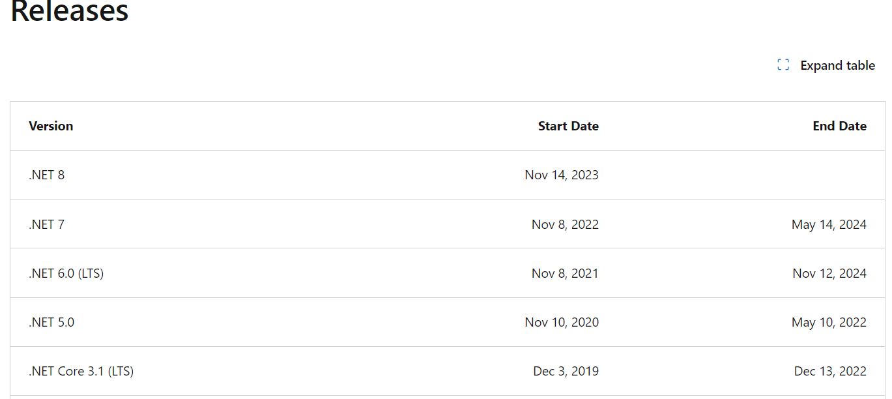

asp.net mvc

The Model
The model is the data of your application.

One way
to think about models and view models is to relate them to database tables and database views.

The View
The view is the user interface of the application. Views accept commands and render the results of those
commands to the user.

The Controller
The controller is the brains of the application. Controllers take commands/requests from the user (via the
view) or client (through API calls) through action methods and handle them appropriately. The results of
the operation are then returned to the user or client.

ASP.NET Core is capable of creating many types of web applications and services. Two of the options are web
applications using the MVC pattern and RESTful services.

The MVC web application and API
application types share the “model” and the “controller” portion of the pattern, while MVC web applications
also implement the “view” to complete the MVC pattern.

Like EF Core, ASP.NET Core is being developed on GitHub as a completely open source project
(https://github.com/aspnet). It is also designed as a modular system of NuGet packages. Developers
only install the features that are needed for a particular application,

Actions
Actions are methods on a controller that return an IActionResult (or Task<IActionResult> for async
operations) or a class that implements IActionResult, such as ActionResult or ViewResult

Model Binding
Model binding is the process where ASP.NET Core uses the name-value pairs submitted in an HTTP Post call
to assign values to models.

Beginning with .NET 5.0, Microsoft .NET Core has been rebranded as .NET.

ASP.NET Core and Entity Framework Core follow the same lifecycle as .NET Core.

1095?