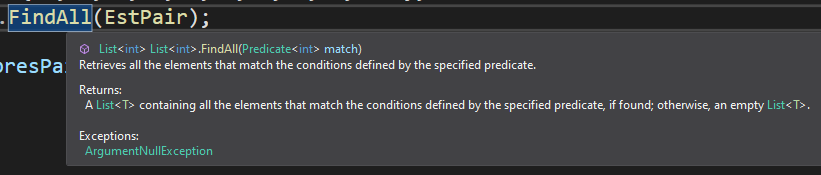

# Notes sur les délégués Action, Func et Predicate en C#

Les délégués Action, Func et Predicate sont des éléments fondamentaux du langage C#. Ils offrent une manière flexible de passer des méthodes en tant que paramètres à d'autres méthodes, ce qui est couramment utilisé dans de nombreuses applications, y compris les événements, les délégués d'événements et le LINQ (Language Integrated Query).

## Utilisation des délégués Action, Func et Predicate

Les délégués Action, Func et Predicate sont utilisés dans divers scénarios, notamment :

- **Callback Functions**: Ils sont souvent utilisés pour définir des fonctions de rappel qui seront invoquées lorsqu'un événement se produit.

- **Filtrage de données**: Dans le contexte de LINQ, Predicate est souvent utilisé pour filtrer des éléments d'une collection basée sur un critère prédéfini.

- **Traitement de collections**: Les délégués Action et Func sont utilisés pour effectuer des opérations sur chaque élément d'une collection.

- **Manipulation de flux de données**: Ils sont également utilisés dans les flux de données pour effectuer des actions sur chaque élément au fur et à mesure qu'ils sont lus ou écrits.

## Est-ce que ces délégués sont encore utilisés aujourd'hui ?

Oui, les délégués Action, Func et Predicate sont toujours largement utilisés dans le développement logiciel en C#. Ils fournissent une flexibilité et une expressivité accrues dans de nombreux scénarios, ce qui en fait des choix populaires pour les développeurs.

## Alternatives

Bien qu'ils soient toujours largement utilisés, il existe des alternatives à ces délégués, notamment l'utilisation de lambda expressions, d'expressions de méthode et de délégués personnalisés. Cependant, ces alternatives peuvent parfois être moins claires ou moins concises que l'utilisation des délégués prédéfinis.

## Implémentation

### Délégué Action

Le délégué Action est utilisé pour représenter une méthode qui ne retourne pas de valeur et prend zéro ou plusieurs arguments en entrée. Voici un exemple d'utilisation :

```csharp
// Définition d'une méthode qui correspond à la signature du délégué Action
void AfficherMessage(string message)
{
    Console.WriteLine(message);
}

// Utilisation du délégué Action pour passer la méthode en tant que paramètre
Action<string> actionDelegate = AfficherMessage;
actionDelegate("Hello, world!");
```

Dans cet exemple, la méthode `AfficherMessage` est passée en tant que paramètre à une instance du délégué Action, qui est ensuite invoquée avec un message spécifique.

### Délégué Func

Le délégué Func est utilisé pour représenter une méthode qui prend des arguments en entrée et retourne une valeur. Voici un exemple d'utilisation :

```csharp
// Définition d'une méthode qui correspond à la signature du délégué Func
int Ajouter(int a, int b)
{
    return a + b;
}

// Utilisation du délégué Func pour passer la méthode en tant que paramètre
Func<int, int, int> funcDelegate = Ajouter;
int resultat = funcDelegate(3, 4); // résultat = 7
```

Dans cet exemple, la méthode `Ajouter` est passée en tant que paramètre à une instance du délégué Func, qui est ensuite invoquée avec deux entiers en entrée et retourne leur somme.

### Délégué Predicate

Le délégué Predicate est utilisé pour représenter une méthode qui définit un critère de correspondance pour un objet donné. Voici un exemple d'utilisation :

```csharp
// Définition d'une méthode qui correspond à la signature du délégué Predicate
bool EstPair(int nombre)
{
    return nombre % 2 == 0;
}

// Utilisation du délégué Predicate pour filtrer une liste d'entiers
List<int> nombres = new List<int> { 1, 2, 3, 4, 5, 6, 7, 8, 9, 10 };
List<int> nombresPairs = nombres.FindAll(EstPair);
```

```csharp
//Classe List
public List<T> FindAll(Predicate<T> match);
```



Dans cet exemple, la méthode `EstPair` est passée en tant que paramètre à la méthode `FindAll` de la liste, qui utilise le délégué Predicate pour filtrer les nombres pairs de la liste initiale.

Les délégués Action, Func et Predicate offrent une flexibilité et une puissance significatives dans le langage C#, ce qui les rend indispensables pour de nombreux développeurs. Bien qu'il existe des alternatives, leur utilisation reste répandue et pertinente dans de nombreux cas d'utilisation.